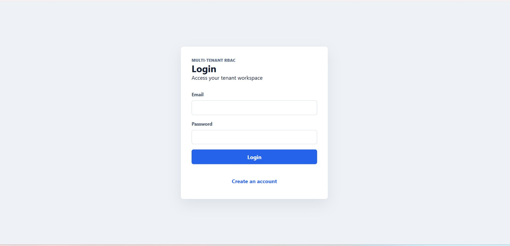
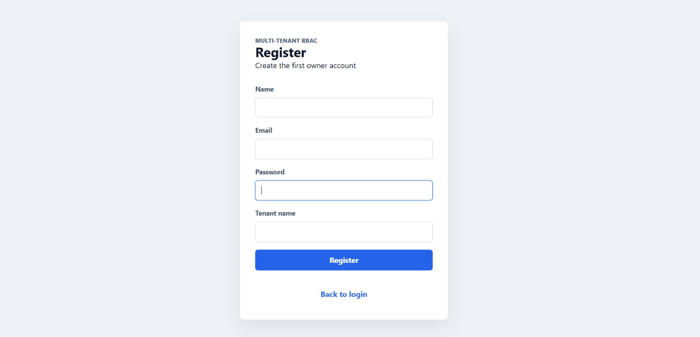
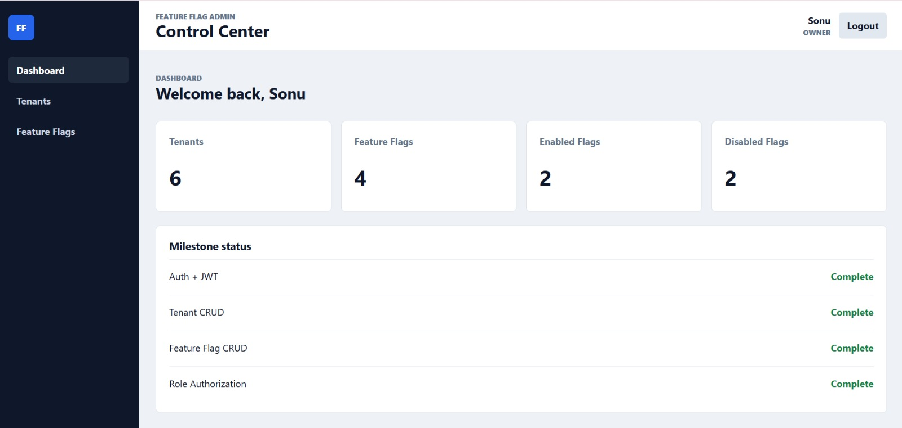
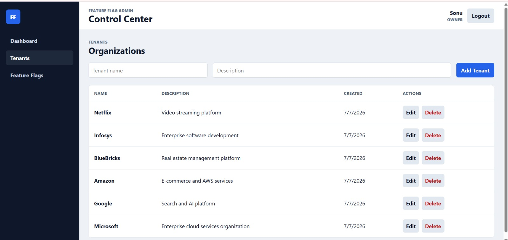
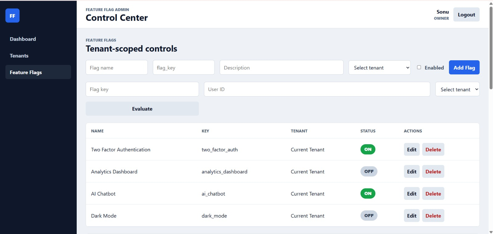

# Multi-Tenant Feature Flag Admin

A full-stack administration dashboard for managing tenants and feature flags. The project demonstrates JWT authentication, role-based access control (RBAC), tenant-aware flag queries, deterministic flag evaluation, audit logging, and a responsive React interface.

## Features

- User registration and login
- JWT access and refresh tokens
- Password hashing with bcrypt
- Role-based authorization for protected operations
- Tenant create, read, update, and delete operations
- Tenant-scoped feature flag CRUD and enable/disable controls
- Public feature flag evaluation endpoint
- Audit history for flag creation, updates, toggles, and deletion
- Dashboard statistics for tenants and flags
- Deterministic percentage-rollout utility with automated tests

## Tech Stack

### Frontend

- React 19
- Vite 8
- JavaScript and CSS
- Browser Fetch API

### Backend

- Node.js
- Express 5
- MongoDB and Mongoose
- JSON Web Tokens (`jsonwebtoken`)
- `bcryptjs`
- Node.js `crypto` for SHA-256 rollout bucketing

## Architecture

```text
React client
    |
    | HTTP/JSON (/api)
    v
Express routes
    |
    +-- Authentication and authorization middleware
    +-- Controllers (auth, tenants, and flags)
    +-- Flag evaluation utility
    |
    v
Mongoose models
    |
    v
MongoDB
```

The API follows a route-controller-model structure. Protected requests carry a bearer token, and authentication middleware adds the decoded user to the request. Flag reads and most flag mutations use the tenant ID from that token. The Vite development server proxies `/api` requests to the Express server.

## Folder Structure

```text
multi-tenant-feature-flag-admin/
|-- client/
|   |-- public/
|   |-- src/
|   |   |-- assets/
|   |   |-- App.jsx
|   |   |-- App.css
|   |   |-- index.css
|   |   `-- main.jsx
|   |-- package.json
|   `-- vite.config.js
|-- server/
|   |-- src/
|   |   |-- config/
|   |   |-- controllers/
|   |   |-- middleware/
|   |   |-- models/
|   |   |-- routes/
|   |   |-- utils/
|   |   |-- app.js
|   |   `-- server.js
|   |-- tests/
|   `-- package.json
`-- README.md
```

## Prerequisites

- Node.js 18 or newer
- npm
- A local MongoDB instance or MongoDB Atlas connection string

## Environment Variables

Create `server/.env`:

```env
PORT=5000
MONGODB_URI=mongodb://127.0.0.1:27017/feature-flag-admin
JWT_SECRET=replace-with-a-long-random-secret
```

The client uses `/api` by default. For a separately hosted API, create `client/.env`:

```env
VITE_API_URL=http://localhost:5000/api
```

## Installation and Setup

```bash
git clone https://github.com/Guptsonu22/multi-tenant-feature-flag-admin.git
cd multi-tenant-feature-flag-admin
```

Install both applications:

```bash
cd server
npm install
cd ../client
npm install
```

Start MongoDB, then run the backend from the `server` directory:

```bash
npm run dev
```

In a second terminal, run the frontend from the `client` directory:

```bash
npm run dev
```

Open the URL printed by Vite (normally `http://localhost:5173`). The API runs on `http://localhost:5000` by default.

For a production-style frontend build:

```bash
cd client
npm run build
npm run preview
```

## Authentication Flow

1. Registration creates a tenant workspace and its first `owner` user.
2. The password is hashed with bcrypt before storage.
3. Registration and login return an access token and refresh token.
4. The client sends the access token as `Authorization: Bearer <token>`.
5. Protected routes verify the token and attach its `userId`, `tenantId`, and `role` claims to the request.
6. `POST /api/auth/refresh` accepts a valid refresh token and issues a new access token.

Access tokens expire after one day; refresh tokens expire after seven days.

## RBAC and Tenant Scoping

The user model supports `owner`, `admin`, `member`, and `viewer` roles. New registrations create an `owner`. Tenant CRUD and flag mutations require `owner` or `admin`; authenticated users may read flags.

Flag reads, updates, toggles, and deletes are filtered using the tenant ID from the authenticated token. Feature flag keys are unique per tenant through a compound MongoDB index on `{ tenantId, key }`.

Current MVP limitations:

- Tenant CRUD operates across the shared tenant collection and is not restricted to the user's own tenant.
- Flag creation accepts a tenant ID from the request body, and flag updates can move a flag to another tenant.
- The public evaluation endpoint accepts a tenant ID supplied by the caller.
- There is no user-management or invitation screen, so additional roles must be provisioned outside the UI.

Strict production isolation would require organization-membership checks on every tenant and flag operation.

## API Routes

Unless marked public, send an access token in the `Authorization` header.

### Authentication

| Method | Route | Access | Purpose |
|---|---|---|---|
| `POST` | `/api/auth/register` | Public | Create an owner and tenant workspace |
| `POST` | `/api/auth/login` | Public | Sign in and receive tokens |
| `POST` | `/api/auth/refresh` | Public | Exchange a refresh token for an access token |

### Tenants

| Method | Route | Access | Purpose |
|---|---|---|---|
| `GET` | `/api/tenants` | Owner/Admin | List tenants |
| `POST` | `/api/tenants` | Owner/Admin | Create a tenant |
| `PUT` | `/api/tenants/:id` | Owner/Admin | Update a tenant |
| `DELETE` | `/api/tenants/:id` | Owner/Admin | Delete a tenant |

### Feature Flags

| Method | Route | Access | Purpose |
|---|---|---|---|
| `GET` | `/api/flags` | Authenticated | List current-tenant flags and recent audit entries |
| `POST` | `/api/flags` | Owner/Admin | Create a flag |
| `PUT` | `/api/flags/:id` | Owner/Admin | Update a flag |
| `PATCH` | `/api/flags/:id/toggle` | Owner/Admin | Toggle a flag |
| `DELETE` | `/api/flags/:id` | Owner/Admin | Delete a flag |
| `POST` | `/api/flags/evaluate` | Public | Evaluate a tenant flag for a user |

Example evaluation request:

```json
{
  "key": "new_dashboard",
  "userId": "user-123",
  "tenantId": "TENANT_OBJECT_ID"
}
```

## Flag Evaluation and Rollout Logic

Boolean flags return their stored `enabled` value. The rollout utility also supports percentage flags by hashing the stable input `userId:flagKey` with SHA-256, taking a bucket from `0` to `99`, and enabling the flag when that bucket is below `rolloutPercentage`.

This makes evaluation deterministic: the same user and flag key always produce the same result. Missing user or flag identifiers fail closed.

The percentage algorithm is implemented and tested at utility level. The current database schema, controllers, and UI configure boolean flags only; persisting and managing percentage flags end to end is listed as a future improvement.

## Audit Logging

Flag creation, update, toggle, and deletion create audit records containing:

- Tenant and actor IDs
- Action name
- Before and after snapshots
- Creation timestamp

The latest 20 audit records for the authenticated tenant are returned with the flag list and displayed on the Feature Flags page.

## Testing and Quality Checks

Run backend rollout tests:

```bash
cd server
node --test tests/flagEvaluation.test.js
```

Run frontend linting and verify a production build:

```bash
cd client
npm run lint
npm run build
```

The automated tests currently cover boolean evaluation and deterministic percentage bucketing. API integration, authorization, and component tests remain future work.

## Screenshots

### Login



### Registration



### Dashboard



### Tenant Management



### Feature Flag Management



## Trade-offs

- A single React file keeps this assignment-sized frontend simple, but larger applications should split pages, API services, and shared components.
- Tokens are stored in `localStorage`, which is straightforward for an MVP but less resistant to XSS than secure, HTTP-only cookies.
- Refresh tokens are stateless and are not persisted or revocable.
- The public evaluation endpoint favors easy SDK-style access but currently has no API key, rate limiting, or request signing.
- Tenant administration and cross-tenant flag selection are intentionally broad in this MVP and require membership-based authorization before production use.
- MongoDB compound indexes provide per-tenant key uniqueness without introducing a separate configuration service or cache.
- Audit history is embedded in the flag-list response for simplicity rather than exposed through a paginated endpoint.
- The application uses local development processes instead of Docker or cloud deployment configuration.

## What I Would Do with More Time

- Add percentage rollout fields to the model, API, and UI
- Add attribute-based targeting and rule priority
- Add organization invitations and user/role management
- Use HTTP-only cookies with refresh-token rotation and revocation
- Secure evaluation with environment-scoped SDK/API keys and rate limiting
- Add pagination, filtering, and search
- Add API validation and OpenAPI/Swagger documentation
- Add integration, authorization, and React component tests
- Add webhook notifications and scheduled flag changes
- Add Redis caching for high-volume evaluation
- Add Docker, CI/CD, monitoring, and production deployment files

## Git Commit History

The repository was developed incrementally with focused commits, including:

```text
d49b053 Initial project setup
0af3413 Completed authentication module
7f4827b Implemented tenant CRUD
dcfe485 Completed feature flag CRUD
3daf66c Added role based authorization
8b5fc66 Frontend pages completed
7a917e7 Connected frontend with backend APIs
617818a Fix registration API proxy issue
dacb54a Enhance tenant and flag management UI
aca1507 Complete feature flag CRUD improvements and UI polish
```

View the complete history with:

```bash
git log --oneline
```

## Repository

[github.com/Guptsonu22/multi-tenant-feature-flag-admin](https://github.com/Guptsonu22/multi-tenant-feature-flag-admin)

## Author

Sonu Gupta<br>
B.Tech Information Technology<br>
Full-Stack Developer
